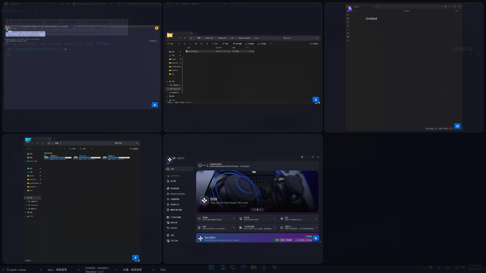

# Window Selector — Keyboard-Driven Alt+Tab Replacement for Windows

[中文說明 (繁體)](README.zh-TW.md)

A fast, zero-config Alt+Tab replacement for Windows 10/11. Press a hotkey to see live DWM thumbnails of every open window in a full-screen grid, then tap a letter key to switch instantly. Built in Rust with Direct2D.

[](https://github.com/LizardLiang/window-selector)
[](LICENSE)
[](https://github.com/LizardLiang/window-selector/releases/latest)
[](https://www.rust-lang.org/)

## Table of Contents

- [Demo](#demo)
- [Features](#features)
- [Why Window Selector?](#why-window-selector)
- [Download & Install](#download--install)
- [Build](#build)
- [Run](#run)
- [Usage](#usage)
- [Configuration](#configuration)
- [Architecture](#architecture)
- [Contributing](#contributing)
- [License](#license)

## Demo

<!-- TODO: Add overlay screenshot at docs/screenshot.png, then uncomment:

Full-screen overlay with live DWM thumbnails, letter labels, and the Quick List bar at the bottom.
-->

*Screenshot coming soon — a demo GIF of the letter-select flow is in the works.*

## Features

- **Live DWM Thumbnails** — Real-time window previews rendered by the Desktop Window Manager, not static screenshots.
- **Keyboard-First Navigation** — Each window is assigned a home-row-first letter (A, S, D, F, G, H, J, K, ...). Press the letter to select, Enter/Space to switch.
- **Number Tagging** — Pin frequently used apps with Ctrl+1 through Ctrl+9. Tags persist across app restarts and resolve to the most recently used matching window.
- **Quick List Bar** — A compact strip at the bottom of the overlay showing all windows with their letter, number tag, and title at a glance.
- **Multi-Monitor Support** — Overlay spans all connected monitors with per-monitor grid layout.
- **MRU Ordering** — Windows are sorted by most-recently-used order, tracked in real time via a WinEvent hook.
- **Accent Color Integration** — Selection highlight uses the Windows system accent color.
- **Aura Glow Effect** — Selected cells have a 3-layer bloom glow for clear visual feedback.
- **System Tray** — Runs in the background with a tray icon. Right-click for Settings, About, or Exit.
- **Configurable Hotkey** — Default is Ctrl+Alt+Q. Change it in the Settings dialog or edit the config file.

## Why Window Selector?

The built-in Windows Alt+Tab requires cycling through every open window one at a time — there is no keyboard shortcut to jump directly to the window you want. Window Selector replaces that workflow with a full-screen grid where every window gets a letter label: press the letter, confirm with Enter or Space, and you're there. No mousing, no cycling.

| Tool | Letter navigation | Live thumbnails | Multi-monitor | Persistent tags | Open source |
|------|:-----------------:|:---------------:|:-------------:|:---------------:|:-----------:|
| Built-in Alt+Tab | — | — | — | — | — |
| PowerToys (no equivalent) | — | — | — | — | ✓ |
| TaskSwitchXP | — | — | — | — | — |
| **Window Selector** | ✓ | ✓ | ✓ | ✓ | ✓ |

Window Selector is the only free, open-source, single-binary option with home-row letter navigation and persistent number tags on Windows 10/11.

## Download & Install

Grab a pre-built binary from the [latest GitHub Release](https://github.com/LizardLiang/window-selector/releases/latest):

- **Portable** — `window-selector.exe`: no installation required.
- **Installer** — `WindowSelector-<version>-setup.exe`: NSIS installer with Start Menu integration.

Portable quick start:

1. Download `window-selector.exe` from the Releases page.
2. Place it anywhere on your system — no installation required.
3. Double-click to run. The application starts minimized to the system tray.
4. Press **Ctrl+Alt+Q** to open the window switcher overlay.

> **Windows Defender SmartScreen:** Because the executable is not yet code-signed, Windows may show a SmartScreen warning on first launch. Click **More info → Run anyway** to proceed. The full source code is available in this repository for review.


## Build

**Requirements:**
- Windows 10/11 (x86_64)
- Visual Studio 2022 Build Tools (MSVC toolchain)
- Rust stable toolchain

```bash
cargo build              # Debug build
cargo build --release    # Release build (LTO enabled)
```

The target triple is hardcoded to `x86_64-pc-windows-msvc` in `.cargo/config.toml`.

## Run

```bash
cargo run                # Debug
cargo run --release      # Release
```

The application starts minimized to the system tray. Press the activation hotkey (default: **Ctrl+Alt+Q**) to open the overlay, or **Win+Y** for label mode.

## Usage

| Action | Key |
|--------|-----|
| Open overlay (full-screen grid) | Ctrl+Alt+Q (configurable) |
| Open label mode (quick labels) | Win+Y (configurable) |
| Select a window | Press the letter shown on its thumbnail/label |
| Switch to selected window | Enter or Space |
| Dismiss overlay | Escape |
| Tag a window's app with a number | Ctrl+1 through Ctrl+9 (while a window is selected) |
| Jump to the tagged app | 1 through 9 |

### Letter Assignment

Letters are assigned in an ergonomic home-row-first order:

```
a s d f g h j k l    (home row)
q w e r t            (top row left)
y u i o p            (top row right)
z x c v b n m        (bottom row)
```

The most recently used window gets **A**, the second gets **S**, and so on. Up to 26 windows can receive a letter.

## Configuration

Config file: `%APPDATA%\window-selector\config.toml`

```toml
hotkey_modifiers = 16387   # MOD_CONTROL | MOD_ALT | MOD_NOREPEAT
hotkey_vk = 81             # VK_Q (Ctrl+Alt+Q for overlay)
label_hotkey_modifiers = 16392   # MOD_WIN | MOD_NOREPEAT
label_hotkey_vk = 89             # VK_Y (Win+Y for label mode)

[[quick_tags]]
number = 1
exe_path = 'C:\\Windows\\System32\\notepad.exe'
```

Logs are written to `%APPDATA%\window-selector\logs\`.

## Architecture

Single-threaded Win32 message pump. All state lives on the main thread — no async runtime, no multi-threading. The keyboard-driven window switcher is implemented in Rust using the `windows` crate for Win32 bindings, Direct2D for rendering, and DWM for live thumbnails.

<details>
<summary>Module breakdown</summary>

| Module | Purpose |
|--------|---------|
| `main.rs` | Entry point, message loop, window procedures |
| `state.rs` | `OverlayState` state machine (Hidden/FadingIn/Active/FadingOut) |
| `overlay.rs` | Overlay window management, show/hide with fade animation |
| `overlay_renderer.rs` | Direct2D + DirectWrite rendering (backdrop, cells, glow, quick list) |
| `dwm_thumbnails.rs` | DWM live thumbnail registration and letterboxing |
| `grid_layout.rs` | Aspect-ratio-driven grid computation |
| `interaction.rs` | Keyboard input handling (pure logic, returns `KeyAction` enum) |
| `window_enumerator.rs` | Window enumeration with Alt+Tab heuristic filters |
| `letter_assignment.rs` | Home-row-first letter sequence |
| `mru_tracker.rs` | Real-time MRU tracking via `EVENT_SYSTEM_FOREGROUND` |
| `window_switcher.rs` | Focus transfer with `AllowSetForegroundWindow` + fallback |
| `animation.rs` | Fade animator (80ms, ~60fps) |
| `config.rs` | TOML config with atomic writes |
| `hotkey.rs` | Global hotkey registration |
| `tray.rs` | System tray icon and context menu |
| `monitor.rs` | Multi-monitor enumeration |
| `accent_color.rs` | Windows system accent color reader |
| `settings_dialog.rs` | Settings dialog (Win32) |
| `about_dialog.rs` | About dialog (Win32) |

</details>

## Contributing

Issues and pull requests welcome. The codebase is single-threaded Win32; read `CLAUDE.md` for architecture notes before submitting a patch. For new features, open an issue first to discuss the approach.

## License

MIT
